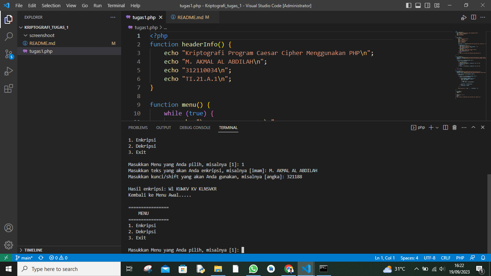
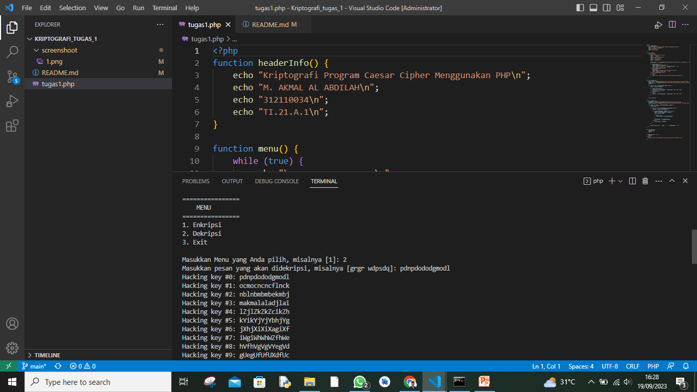
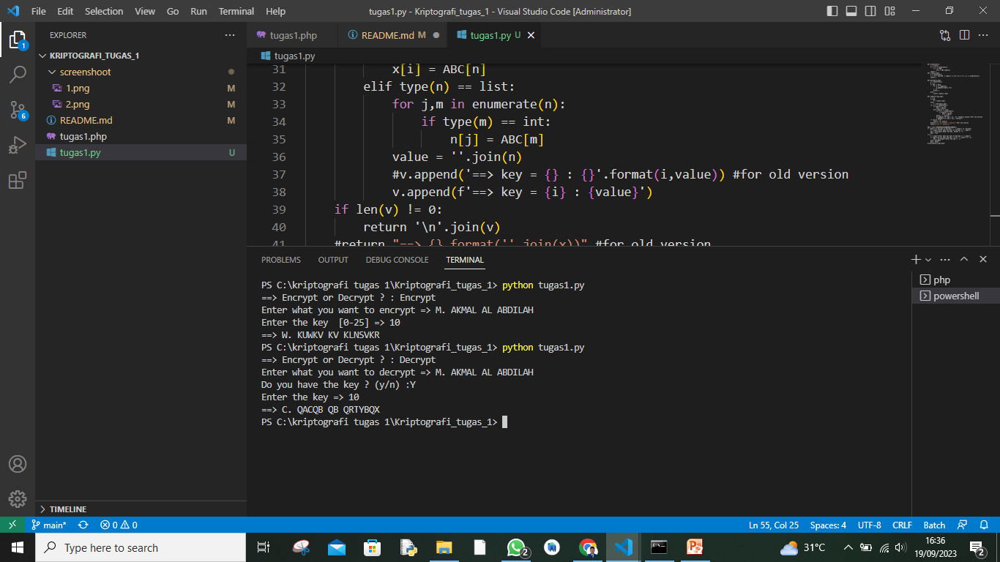

# Kriptografi Pertemuan 1

## Profil
| #               | Biodata                      |
| --------------- | ---------------------------- |
| **Nama**        | M. AKMAL AL ABDILAH          |
| **NIM**         | 312110034                    |
| **Kelas**       | TI.21.A.1                    |
| **Mata Kuliah** | Kriptografi                  |


<p align="center">
 
</p>
<p align="center">
<a href="https://github.com/akmalabdilah"></a>
<p align="center">

<hr>

## Kriptografi Program Caesar Cipher Menggunakan Python dan PHP 

<hr>

<p>
Disini saya akan menjelaskan secara singkat apa itu Kriptografi Program Caesar Cipher Menggunakan PHP,

Kriptografi Program Caesar Cipher Menggunakan PHP adalah sebuah program yang digunakan untuk melakukan enkripsi dan dekripsi teks menggunakan metode Caesar Cipher. 

Caesar Cipher adalah teknik enkripsi sederhana yang menggeser setiap huruf dalam teks asli sejauh jumlah tertentu dalam abjad. Program ini dibuat dengan menggunakan bahasa pemrograman PHP dan memungkinkan pengguna untuk memasukkan teks, mengatur jumlah pergeseran (kunci), dan kemudian mengenkripsi atau mendekripsi teks sesuai dengan pergeseran yang ditentukan. 

Program ini dibuat oleh Lindo Prasetyo dan mencakup fitur-fitur seperti menu, enkripsi, dekripsi, dan tampilan informasi header. Tujuan utama dari program ini adalah untuk memahami dan mengimplementasikan konsep dasar dalam kriptografi dengan menggunakan metode Caesar Cipher.
</p>

<p>
Oke tanpa basa basi laki ini adalah score code dan gambaran hasilnya.
</p>


<p>

</p>

<hr>Untuk yang sudah membuat tugas, ada beberapa perbaikan...


1. Buat programnya encrypt dan decrypt....


2. Untuk output encrypt hilangkan semua spasi....


Yang sudah mengumpulkan silahkan direvisi...

Yang belum, silahkan dikerjakan

## Kriptografi Program Caesar Cipher Menggunakan PHP 

<hr>

```php
function headerInfo() {
    echo "Kriptografi Program Caesar Cipher Menggunakan PHP\n";
    echo "M. AKMAL AL ABDILAH\n";
    echo "312110034\n";
    echo "TI.21.A.1\n";
}

function menu() {
    while (true) {
        echo "\n================\n";
        echo "    MENU\n";
        echo "================\n";
        echo "1. Enkripsi\n";
        echo "2. Dekripsi\n";
        echo "3. Exit\n\n";

        $input_menu = (int)readline("Masukkan Menu yang Anda pilih, misalnya [1]: ");

        if ($input_menu == 1) {
            $hasil_enkripsi = enkripsi();
            echo "\nHasil enkripsi: " . $hasil_enkripsi . "\n";
            echo "Kembali ke Menu Awal.....\n";
        } elseif ($input_menu == 2) {
            dekripsi();
            echo "\nHasil dekripsi bisa dilihat di atas\n";
            echo "Kembali ke Menu Awal.....\n";
        } elseif ($input_menu == 3) {
            break;
        } else {
            echo "Error: pastikan Anda memasukkan angka yang benar!\n";
        }
    }
}

function enkripsi() {
    $input_text = readline("Masukkan teks yang akan Anda enkripsi, misalnya [imam]: ");
    $input_key = (int)readline("Masukkan kunci/shift yang akan Anda gunakan, misalnya [angka]: ");
    $result = "";

    for ($i = 0; $i < strlen($input_text); $i++) {
        $char = $input_text[$i];

        if (ctype_upper($char)) {
            $result .= chr((ord($char) + $input_key - 65) % 26 + 65);
        } elseif ($char == " ") {
            $result .= " ";
        } else {
            $result .= chr((ord($char) + $input_key - 97) % 26 + 97);
        }
    }

    return $result;
}

function dekripsi() {
    $Alphabet = "ABCDEFGHIJKLMNOPQRSTUVWXYZabcdefghijklmnopqrstuvwxyz";
    $input_encrypted = readline("Masukkan pesan yang akan didekripsi, misalnya [grgr wdpsdq]: ");

    for ($key = 0; $key < strlen($Alphabet); $key++) {
        $translated = "";

        for ($i = 0; $i < strlen($input_encrypted); $i++) {
            $symbol = $input_encrypted[$i];

            if (strpos($Alphabet, $symbol) !== false) {
                $num = strpos($Alphabet, $symbol);
                $num = $num - $key;

                if ($num < 0) {
                    $num = $num + strlen($Alphabet);
                }

                $translated .= $Alphabet[$num];
            } else {
                $translated .= $symbol;
            }
        }

        echo "Hacking key #" . $key . ": " . $translated . "\n";
    }
}

function main() {
    headerInfo();
    menu();
}

if (PHP_SAPI === 'cli') {
    main();
} else {
    echo "Program ini dimaksudkan untuk dijalankan dari command line.";
}
?>

```





<hr>

## Kriptografi Program Caesar Cipher Menggunakan Tugas Menggunakan Python

<hr>


```python

def transform(x): 
    x = list(x)
    for i,n in enumerate(x):
        if n in ABC:
            x[i] = ABC.index(n)
    return x
def crypt(x,key):
    x = transform(x)
    x = [(n + key)%26 if type(n) == int else n for i,n in enumerate(x)]
    return x

def decrypt(x,key):
    x = transform(x)
    d = []
    if key == None:
        for k in range(26):
            d.append(crypt(x,-k))
        x = d
        return x
    else: 
        return crypt(x,-key)

def caesar(x,key,mod):
    v = []
    if mod:
        x = crypt(x,key)
    else:
        x = decrypt(x,key)
    for i,n in enumerate(x):
        if type(n) == int:
            x[i] = ABC[n]
        elif type(n) == list:
            for j,m in enumerate(n):
                if type(m) == int:
                    n[j] = ABC[m]
            value = ''.join(n)
            #v.append('==> key = {} : {}'.format(i,value)) #for old version
            v.append(f'==> key = {i} : {value}')
    if len(v) != 0:
        return '\n'.join(v)
    #return "==> {}.format(''.join(x))" #for old version
    return f"==> {''.join(x)}"

ABC = list('ABCDEFGHIJKLMNOPQRSTUVWXYZ')
if input('==> Encrypt or Decrypt ? : ').lower() == 'encrypt':
    x = input('Enter what you want to encrypt => ').upper()
    key = int(input('Enter the key  [0-25] => '))
    mod = True
else : 
    x = input('Enter what you want to decrypt => ').upper()
    if input('Do you have the key ? (y/n) :').lower() == 'y':
        key = int(input('Enter the key => '))
    else: key=None
    mod = False	
print(caesar(x,key,mod))


```




<p>
 sekian selesai.
</p>

<div>
<h2 align="center">Thanks For Reading!!!</h2>
<div align="center">
